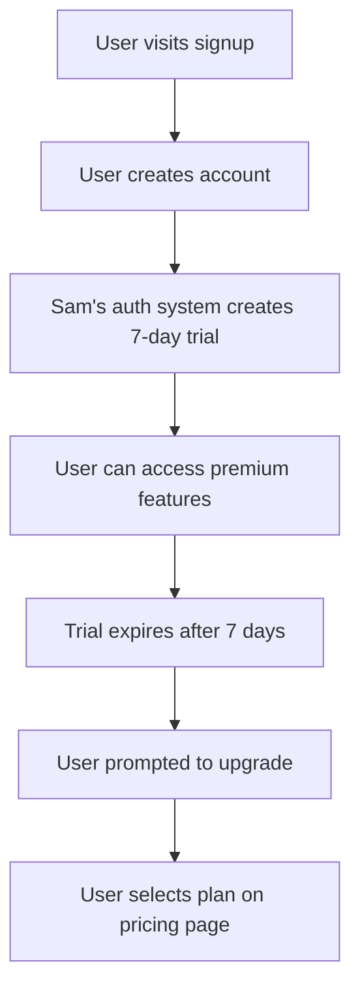
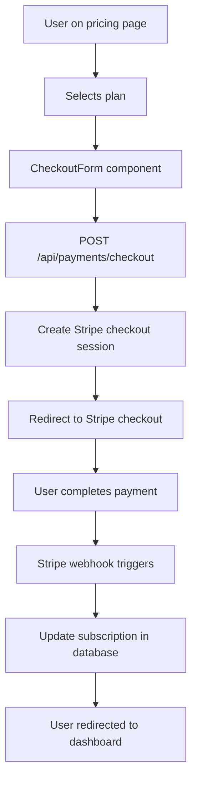
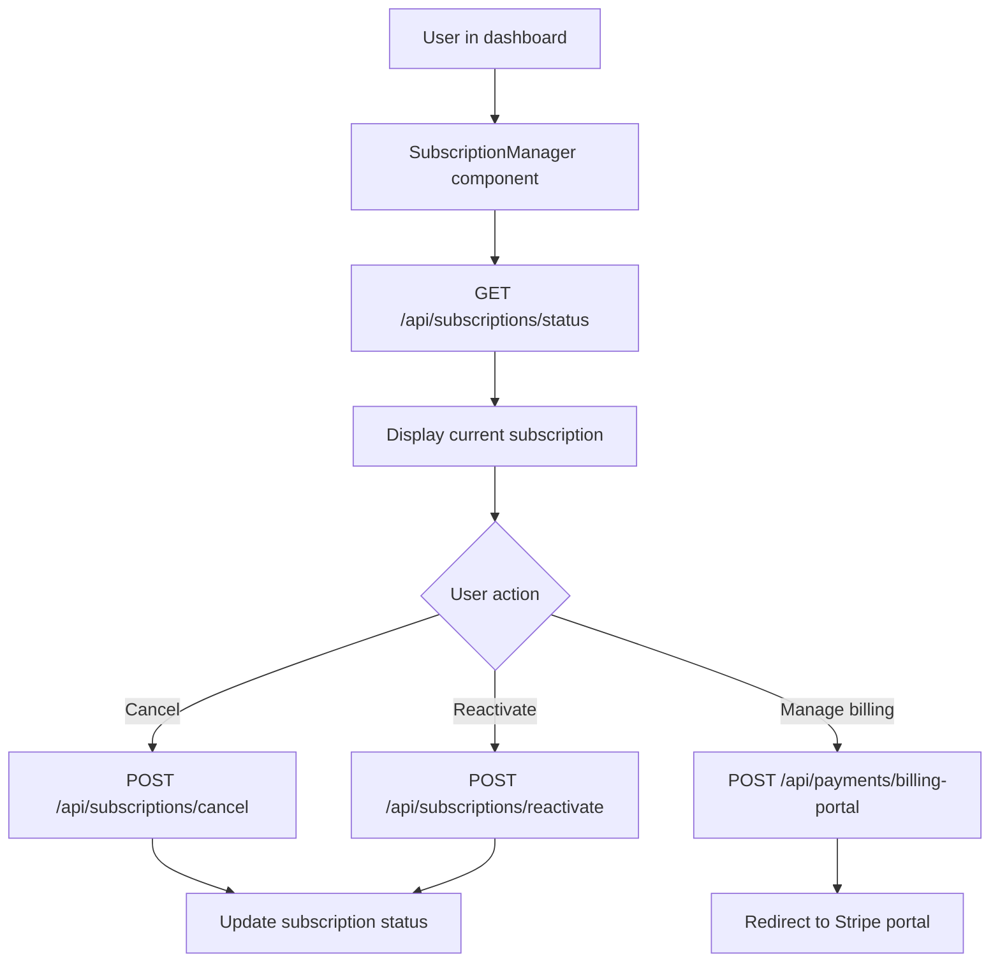

# Payment System Documentation

## Overview
This document outlines the payment system architecture and flows for the Interview Prep Platform, implementing a subscription-based model with Stripe integration and a 7-day free trial.

## Pricing Structure

### Plans Available
1. **Weekly Premium** - $9.00/week
   - Full access to all features
   - Weekly billing cycle
   - 7-day free trial

2. **Monthly Premium** - $29.00/month (20% savings)
   - All Weekly Premium features
   - Monthly billing cycle (saves 20% vs weekly)
   - 7-day free trial

### Free Trial
- **Duration**: 7 days
- **Activation**: Automatic on signup (handled by Sam's authentication system)
- **Features**: Full access to all premium features
- **Conversion**: Users can upgrade during or after trial

## Architecture Overview

### Component Structure
```
src/
├── lib/stripe/
│   ├── config.ts          # Stripe configuration and pricing
│   ├── client.ts          # Mock Stripe client implementation
│   ├── webhook-handlers.ts # Webhook event processing
│   └── index.ts           # Main exports
├── components/payments/
│   ├── PricingCard.tsx    # Individual plan display
│   ├── CheckoutForm.tsx   # Payment form
│   ├── SubscriptionManager.tsx # Manage active subscriptions
│   └── index.ts           # Component exports
└── app/
    ├── pricing/page.tsx   # Pricing page
    └── api/
        ├── payments/
        │   ├── checkout/route.ts      # Create checkout sessions
        │   └── billing-portal/route.ts # Billing management
        └── subscriptions/
            ├── status/route.ts        # Get subscription status
            ├── cancel/route.ts        # Cancel subscription
            ├── reactivate/route.ts    # Reactivate subscription
            └── webhook/route.ts       # Handle Stripe webhooks
```

## Payment Flows

### 1. User Registration & Trial Flow


### 2. Subscription Purchase Flow


### 3. Subscription Management Flow


## API Endpoints

### Payment Endpoints

#### POST /api/payments/checkout
Creates a new Stripe checkout session for subscription.

**Request:**
```json
{
  "planId": "weekly" | "monthly",
  "successUrl": "https://domain.com/success",
  "cancelUrl": "https://domain.com/cancel"
}
```

**Response:**
```json
{
  "success": true,
  "data": {
    "sessionId": "cs_...",
    "url": "https://checkout.stripe.com/...",
    "customerId": "cus_..."
  }
}
```

#### POST /api/payments/billing-portal
Creates a Stripe billing portal session for subscription management.

**Response:**
```json
{
  "success": true,
  "data": {
    "url": "https://billing.stripe.com/..."
  }
}
```

### Subscription Management Endpoints

#### GET /api/subscriptions/status
Returns the current user's subscription status.

**Response:**
```json
{
  "success": true,
  "data": {
    "hasSubscription": true,
    "subscription": {
      "id": "uuid",
      "planName": "Weekly Premium",
      "status": "active",
      "currentPeriodStart": "2024-01-01T00:00:00Z",
      "currentPeriodEnd": "2024-01-08T00:00:00Z",
      "priceAmount": 900,
      "pricePeriod": "week",
      "cancelAtPeriodEnd": false
    }
  }
}
```

#### POST /api/subscriptions/cancel
Cancels the user's subscription.

**Request:**
```json
{
  "subscriptionId": "uuid",
  "cancelImmediately": false
}
```

#### POST /api/subscriptions/reactivate
Reactivates a canceled subscription (before period end).

**Request:**
```json
{
  "subscriptionId": "uuid"
}
```

#### POST /api/subscriptions/webhook
Handles Stripe webhook events for subscription lifecycle management.

## Database Schema Integration

### Subscription Plans Table
The system uses the existing `subscription_plans` table with these records:
- **Free Trial**: 7-day trial with limited access
- **Weekly Premium**: $9/week with full access
- **Monthly Premium**: $29/month with full access

### User Subscriptions Table
The `user_subscriptions` table tracks:
- Current subscription status
- Billing periods
- Stripe customer and subscription IDs
- Trial periods
- Cancellation status

## Security Considerations

### Payment Security
- **PCI Compliance**: All payment processing handled by Stripe
- **No Card Storage**: Payment information never stored locally
- **Webhook Verification**: Stripe webhook signatures verified (production)
- **HTTPS Only**: All payment endpoints require HTTPS

### Authentication & Authorization
- **Protected Endpoints**: All subscription management requires authentication
- **User Verification**: Subscription operations limited to resource owners
- **Rate Limiting**: Implemented on all payment endpoints

### Data Protection
- **Row Level Security**: Database policies prevent cross-user access
- **Input Validation**: All request data validated with Zod schemas
- **Error Handling**: Secure error responses without information disclosure

## Mock Implementation

### Development Mode
For development and testing, the system includes:
- **Mock Stripe Client**: Simulates Stripe API responses
- **Mock Webhooks**: Can simulate webhook events locally
- **Test Data**: Automated creation of mock subscription records

### Production Setup
To enable real Stripe integration:
1. Replace mock client with actual Stripe SDK
2. Configure environment variables:
   ```env
   NEXT_PUBLIC_STRIPE_PUBLISHABLE_KEY=pk_live_...
   STRIPE_SECRET_KEY=sk_live_...
   STRIPE_WEBHOOK_SECRET=whsec_...
   STRIPE_WEEKLY_PRICE_ID=price_...
   STRIPE_MONTHLY_PRICE_ID=price_...
   ```
3. Set up Stripe webhook endpoints
4. Configure Stripe products and prices

## User Experience Flow

### First-Time User
1. **Discovery**: User visits pricing page
2. **Registration**: User signs up (gets 7-day free trial)
3. **Trial**: User explores premium features
4. **Conversion**: User upgrades before trial expires
5. **Payment**: Seamless checkout via Stripe
6. **Access**: Immediate access to paid features

### Existing User
1. **Dashboard**: View current subscription status
2. **Management**: Cancel, reactivate, or modify subscription
3. **Billing**: Access Stripe portal for payment methods
4. **Support**: Contact support for subscription issues

## Error Handling

### Payment Failures
- **Card Declined**: Clear error messages with retry options
- **Network Issues**: Graceful degradation with retry mechanisms
- **Webhook Failures**: Automatic retry with exponential backoff

### Subscription Issues
- **Trial Expiration**: Graceful degradation to free tier
- **Payment Past Due**: Temporary access suspension with payment prompts
- **Cancellation**: Immediate confirmation with end-of-period access

## Monitoring & Analytics

### Key Metrics
- **Conversion Rate**: Trial to paid conversion
- **Churn Rate**: Monthly subscription cancellations
- **Revenue Metrics**: MRR, ARR, and growth rates
- **Payment Success**: Success/failure rates for transactions

### Alerts
- **Payment Failures**: Immediate alerts for failed payments
- **High Churn**: Alerts when cancellation rates spike
- **Webhook Issues**: Monitoring for webhook processing failures

## Testing Strategy

### Unit Tests
- Payment component functionality
- API endpoint validation
- Webhook event processing

### Integration Tests
- End-to-end checkout flows
- Subscription lifecycle management
- Database consistency checks

### Manual Testing
- User journey testing
- Payment flow validation
- Error scenario handling

## Compliance & Legal

### Subscription Management
- **Clear Terms**: Transparent pricing and billing terms
- **Easy Cancellation**: One-click cancellation process
- **Billing Transparency**: Clear billing period communication
- **Refund Policy**: Clear refund terms and process

### Data Handling
- **GDPR Compliance**: User data protection and deletion rights
- **PCI DSS**: Stripe handles all PCI compliance requirements
- **Terms of Service**: Clear subscription terms and conditions

---

*This documentation covers the complete payment system implementation. For technical support or modifications, refer to the component source code and API documentation.*